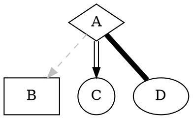

# 前端架构

Phodal Huang

## 表格

|  表头   | 表头  |
|  ----  | ----  |
| 单元格  | 单元格 |
| 单元格  | 单元格 |

| 意见项  | 意见  | 修改方式    | 快捷键  |
|--------|------|-----------|--------|

## 靠人做重构有什么问题？

靠人做大规模重构，识别 bad smell 比较困难 -> by exp

（复杂的依赖关系，过长的调用链，靠人难找）

但是有经验的人不多，效率又比较低

基于 exp 沉淀出模式，通过模式承载工具

靠人具有不可持续性，

它可以作为适应度函数，持续演进架构。

## Slide1

Slide 2 的内容

## Slide 2

> Quotessss

## Slide 3

```python
class SimpleSlideVO(object):
    def __init__(self):
        self.header = ''
        self.paragraph = ''
        self.quote = ''
        self.title = ''
        self.code = ''
        self.lang = ''
        super().__init__()
```

## Slide 4

aflkasjf asdf a
fdsa
f

## Slide 5


## LIST

 - item 1
 - item 2
 - item 3
 - item 4

## DDDDD

