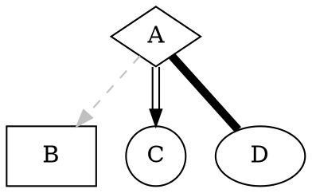

# 这是一个标题啊啊

|  表头   | 表头  |
|  ----  | ----  |
| 单元格  | 单元格 |
| 单元格  | 单元格 |

| 意见项  | 意见  | 修改方式    | 快捷键  |
|--------|------|-----------|--------|
| 判断条件 | 

## Slide1

Slide 2 的内容

## Slide 2

> Quotessss

## Slide 3

```python
class SimpleSlideVO(object):
    def __init__(self):
        self.header = ''
        self.paragraph = ''
        self.quote = ''
        self.title = ''
        self.code = ''
        self.lang = ''
        super().__init__()
```

## Slide 4

aflkasjf asdf a
fdsa
f

## Slide 5


## LIST

 - item 1
 - item 2
 - item 3
 - item 4

## DDDDD

